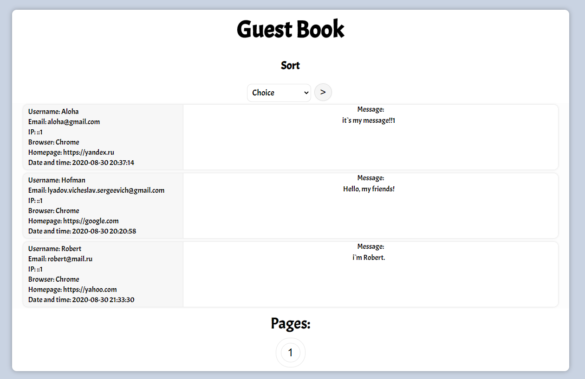
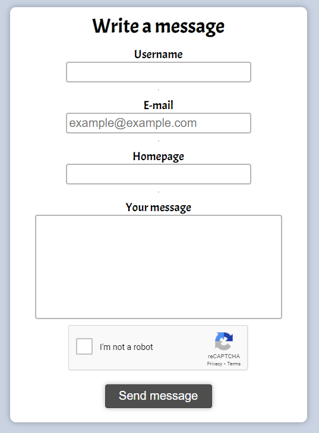

# Guest Book

This project is the implementation of an introductory assignment for an internship in a company **PENA Production**.

In the course of the work, the "Guest Book" site was implemented. The site allows you to write messages (reviews) from visitors on the Internet.

### Features!

  - Safety.
  - Sorting by username, email, date of posting.
  - Robot protection.
  - Pagination of 25 messages each.
  - Beautiful design. :)

### Technology!

  - HTML;
  - CSS;
  - PHP;
  - MySQL;

### Safety.
In the course of the work, the processing of input data from **SQL-injections** and **XSS**.
The implementation of these functions is in the file *'secure.php'*.
Was also implemented **reCAPTCHA v2** from *Google Team*. ***(GitHub - https://github.com/google/recaptcha)***

This project was developed on a local server using **XAMPP technology**.
Project site - https://www.apachefriends.org/ru/index.html

License
----

MIT

**Free Software, Hell Yeah!**
